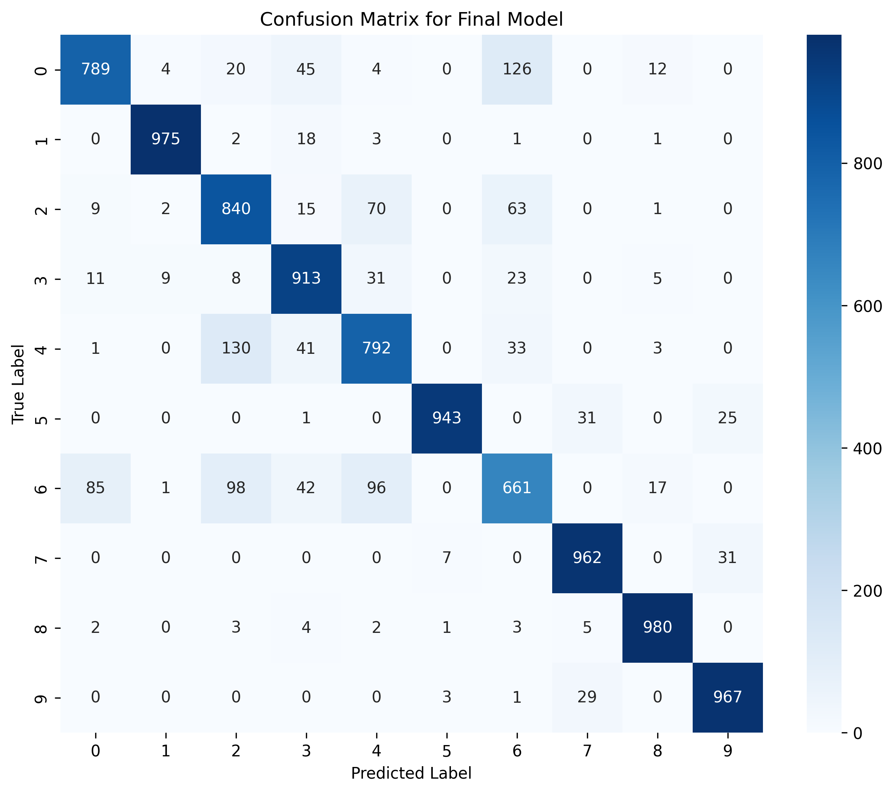
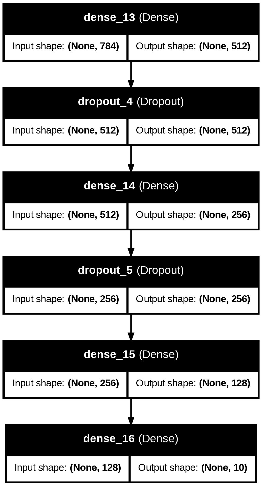

# Model Evaluation Results

This directory contains key visualisations generated during the evaluation of the Fashion-MNIST deep learning model.

## Confusion Matrix

The confusion matrix shows the classification performance of the final model across the 10 Fashion-MNIST classes. Strong values along the diagonal indicate that the model correctly classifies most samples, while the off-diagonal values highlight classes that are more difficult to distinguish.

## Model Architecture

The final neural network uses multiple dense layers with dropout regularisation. The architecture progressively reduces the feature representation from 784 input features to 10 output classes.

The model includes:

- Dense layer: 512 units
- Dropout regularisation
- Dense layer: 256 units
- Dropout regularisation
- Dense layer: 128 units
- Output layer: 10 units

These visualisations provide a concise overview of the final model architecture and its classification performance.
